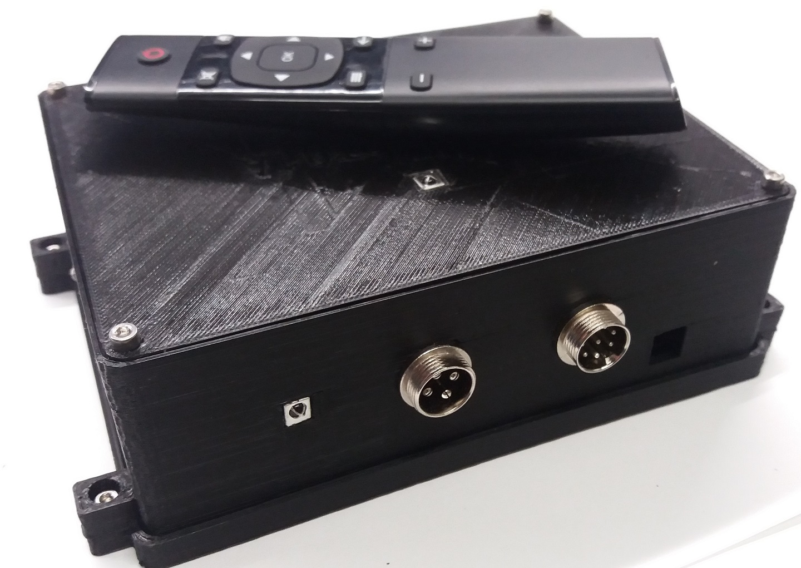

# CLOCKMOT
Universal telescope clock machine

Equipment for autonomous time tracking of a astronomical object with astronomy teloscope. It could be commanded via IR Remote control. For stepper motors up to 45 V and 3 A.

